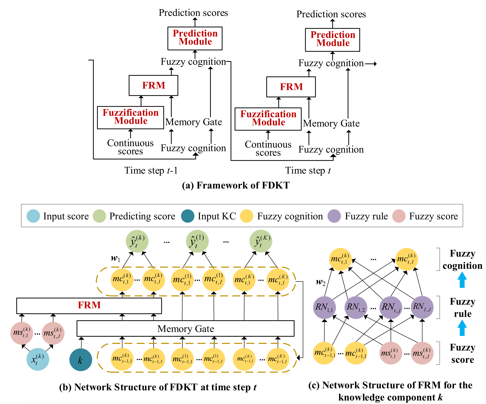

# FDKT: Towards an interpretable deep knowledge tracing via fuzzy reasoning

This is our implementation for the paper titled **FDKT: Towards an interpretable deep knowledge tracing via fuzzy reasoning**

**Author**: Fei Liu, Chenyang Bu, Haotian Zhang, Le Wu, Kui Yu, and Xuegang Hu

**Abstract**: In educational data mining, knowledge tracing (KT) aims to model learning performance based on student knowledge mastery. Deep-learning-based KT models perform remarkably better than traditional KT and have attracted considerable attention. However, most of them lack interpretability, making it challenging to explain why the model performed well in the prediction. In this paper, we propose an interpretable deep KT model, referred to as fuzzy deep knowledge tracing (FDKT) via fuzzy reasoning. Specifically, we formalize continuous scores into several fuzzy scores using the fuzzification module. Then, we input the fuzzy scores into the fuzzy reasoning module (FRM). FRM is designed to deduce the current cognitive ability, based on which the future performance was predicted. FDKT greatly enhanced the intrinsic interpretability of deep-learning-based KT through the interpretation of the deduction of student cognition. Furthermore, it broadened the application of KT to continuous scores. Improved performance with regard to both the advantages of FDKT was demonstrated through comparisons with 15 state-of-the-art models, using 4 real-world datasets.

## Framework


##   UIE
Code for **FDKT: Towards an interpretable deep knowledge tracing via fuzzy reasoning**.

Please contect [Fei Liu](feiliu@mail.hfut.edu.cn) for questions and suggestions.

    
##   Environment Settings
### Dependencies
```
- python==3.9
- torch==1.7
- torchnet
```

### Devices
 Our model supports running on both CPU and GPU devices. If you wish to run it on a CPU, please set `use_gpu = False` in the *config.py file*. Otherwise, please set `use_gpu = True`.
 
### Hyper-parameters
  The majority of our hyperparameters are set in the config.py file. Please modify them according to your needs. Below are the default settings for some of the hyperparameters. Please note that these values can be adjusted as per your specific requirements.
```
    term_numbers = 6
    cog_numbers = 6
    rule_numbers = term_numbers * cog_numbers
    weight_decay = 0.001
    learning_rate = 0.01
    batch_size = 128
```
 
### Files
This is the code structure of the repository. It mainly includes the following files, with corresponding explanations of their functionalities:

```
- data # This file handles data loading, preprocessing, and data-related operations
  - data_deal.py
  - fdktdata.py
- model
  - fdkt.py # implement of the fdkt model
  - fnn.py  # implement of the fnn network, which is used by fdkt
- utils # This file contains utility functions used throughout the codebase
  - mkdir.py # if the folder does not exist, create a new folder
  - obtain_metrics.py # calculating the metrics including rmse, mae, auc
  - write_csv.py # writing the results
- config.py # This file stores configuration settings and parameters for the program. You can set the hyperparameters of the fdkt model in this files
- main.py # This file contains the main code for running the program
- README.md # This file provides documentation and instructions on how to use the codebase
```
 
##   Run Steps
 If you want to run this program on the command line, please switch to the directory where main.py is located firstly.

For example:
```
    cd dir
    python main.py
```

### Datasets
The model has been proposed to solve the KT task in a continuous scoring scenario with subjective questions. Therefore, the dataset you use needs to include the following information: student id, concept id examined in the exercise, and the continuous score of the student answering the exercise.

Data folder contains two files：`training.txt` and `testing.txt`. In each files, there are response records of different students included. Here is an example of the data format in each file:
```
8
5 6 1 5 1 1 6 8 
0.2 1.0 0.0 0.5 0.4 0.8 0.7 0.0
5
5 3 2 2 5
0.5 0.4 0.8 0.5 1.0
```
The example shows the interaction record sequences of two students. Each student has three lines of data. The first line is an integer that represents the total number of interaction steps for that student. The second line represents the concept IDs of the student's interactions at each time step. The third line represents the scores of the student's interactions at each time step.


## Dataset List

We collect the commonly used datasets and listed them here. The meaning of the fields in the table below is as follows:
- Exercise Text: contain textual information of exercise or not
- Concet Relation: contain relations among knowledge concepts or not (tree or prerequisite)
- Time: contain time for students to start answering questions or not


| Dataset Name                                                 | Exercise Text | Concept Relation | Time |
| :----------------------------------------------------------- | :-----------: | :--------------: | :--: |
| [FrcSub](http://staff.ustc.edu.cn/~qiliuql/data/math2015.rar) |       ✖️       |        ✖️         |  ✖️   |    
| [Math1](http://staff.ustc.edu.cn/~qiliuql/data/math2015.rar) |       ✖️       |        ✖️         |  ✖️   |    
| [Math2](http://staff.ustc.edu.cn/~qiliuql/data/math2015.rar) |       ✖️       |        ✖️         |  ✖️   |     
| [AAAI_2023](https://docs.google.com/forms/d/e/1FAIpQLScWjxiXdSMAKBtlPJZm9MsudUG9CQS16lT0GVfajpVj-mWReA/viewform?pli=1) |       ✔️       |     ✔️(tree)      |  ✔️   |  
| [ASSISTment_2009-2010](https://drive.google.com/file/d/0B2X0QD6q79ZJUFU1cjYtdGhVNjg/view?resourcekey=0-OyI8ZWxtGSAzhodUIcMf_g) |       ✖️       |        ✖️         |  ✔️   |    
| [ASSISTment_2012-2013](https://sites.google.com/site/assistmentsdata/datasets/2012-13-school-data-with-affect) |       ✖️       |        ✖️         |  ✔️   |    
| [ASSISTment_2015-2016](https://sites.google.com/site/assistmentsdata/datasets/2015-assistments-skill-builder-data) |       ✖️       |        ✖️         |  ✔️   |     
| [ASSISTment_2017](https://sites.google.com/view/assistmentsdatamining/dataset) |       ✖️       |        ✖️         |  ✔️   |      
| [Algebera_2005-2006](https://pslcdatashop.web.cmu.edu/KDDCup/downloads.jsp) |       ✖️       |        ✖️         |  ✔️   |     
| [Algebera_2006-2007](https://pslcdatashop.web.cmu.edu/KDDCup/downloads.jsp) |       ✖️       |        ✖️         |  ✔️   |      
| [Bridge2Algebra_2006-2007](https://pslcdatashop.web.cmu.edu/KDDCup/downloads.jsp) |       ✖️       |        ✖️         |  ✔️   |      
| [Junyi_AreaTopicAsCpt](https://pslcdatashop.web.cmu.edu/Project?id=244) |       ✖️       |     ✔️(tree)      |  ✔️   |      
| [Junyi_ExerAsCpt](https://pslcdatashop.web.cmu.edu/Project?id=244) |       ✖️       | ✔️(prerequisite)  |  ✔️   |     
| EdNet_KT1                                                    |       ✖️       |        ✖️         |  ✔️   |     
| [Eedi_2020_Task1&2](https://dqanonymousdata.blob.core.windows.net/neurips-public/data.zip) |       ✖️       |     ✔️(tree)      |  ✔️   |      
| [Eedi_2020_Task3&4](https://dqanonymousdata.blob.core.windows.net/neurips-public/data.zip) |       ✔️(images)       |     ✔️(tree)      |  ✔️   |     

##   Cite
```
@article{liu2024fuzzykt,
  title={FDKT: Towards an interpretable deep knowledge tracing via fuzzy reasoning},
  author={Fei Liu, Chenyang Bu, Haotian Zhang, Le Wu, Kui Yu, and Xuegang Hu},
  year={2023}
}
```